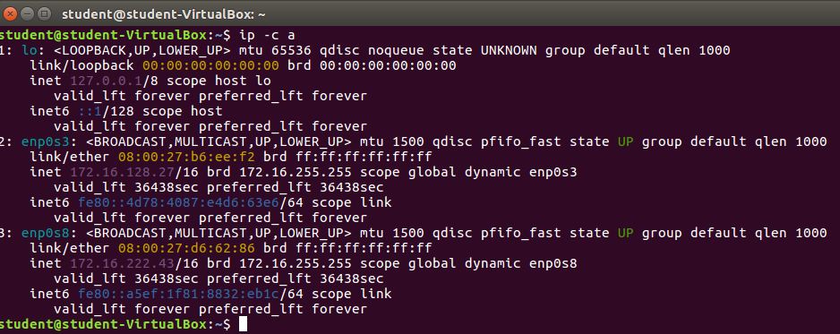
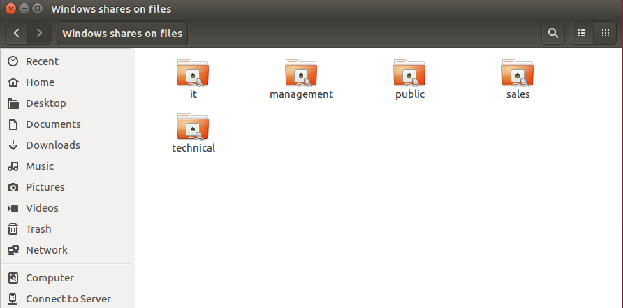

# Enterprise Linux Lab Report 04

- Student name: Maxim Eeckhout
- Github repo: <https://github.com/HoGentTIN/elnx-1819-sme-maximeeckhout>

Omschrijving assignment04:
- Opzetten van DHCP server
- Instellen van een router met vyos

## Test plan

Opmerking: Destroy de VM voor het uitvoeren van de testen.

- Opzetten van een virtuele machine met 2 host-only netwerk interfaces (beide verbonden met het host-only netwerk 172.16.0.0./16)
- Onthouden van 1 van de 2 MAC adressen van de interfaces
- VM opstarten en controleren welk IP-address wordt toegekend aan welke interface
- Controleren of de VM kan surfen naar <http://www.avalon.lan>
- Controleren of de VM de fileserver kan bereiken via SMB en FTP

## Procedure/Documentation

1. Download de rol bertvv.dhcp en bertvv.rh-base
2. Voeg de rol en de nieuwe vm toe aan site.yml
```
# DHCPServer
- hosts: pr001
  become: true
  roles:
    - bertvv.rh-base
    - bertvv.dhcp
```
3. Configureer DHCP via de variabelen van de rollen.
 * Range maken met IP's
 * Specifieke IP uitdelen via MAC adres
 
4. Configureer de router in het script: "router-config.sh"

## Test report

We zien dat we de verwachte waarden krijgen bij de 2 netwerkkaarten. Verder is het ook mogelijk om naar <http://www.avalon.lan> als naar <http://www.google.be> te surfen. Ook de fileserver is bereikbaar.




## Resources

* <https://vyos.io>
* <https://wiki.vyos.net/wiki/User_Guide>
* <https://galaxy.ansible.com/bertvv/dhcp>
