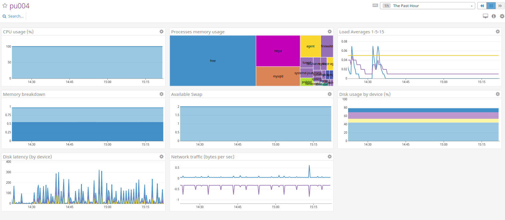
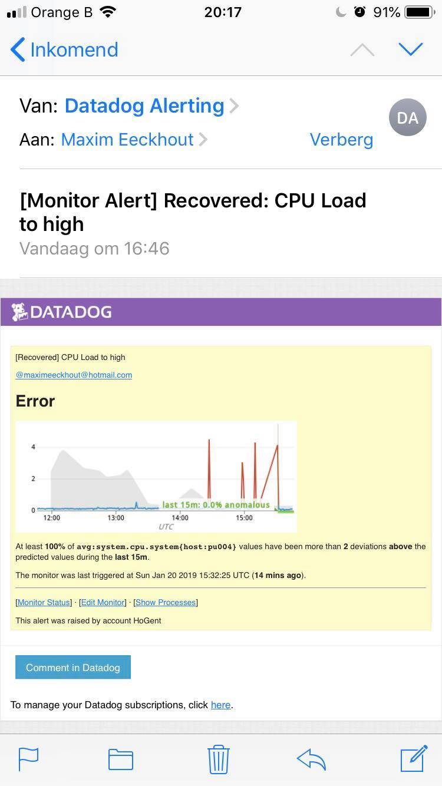
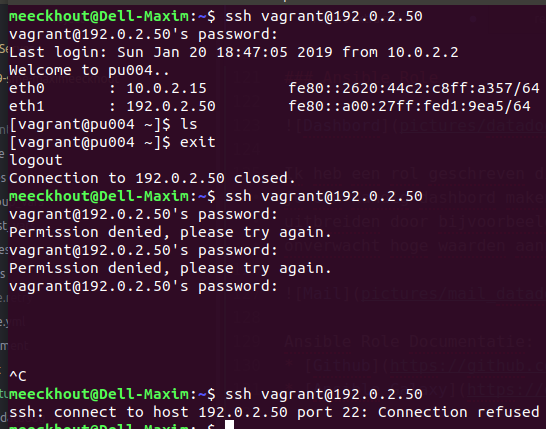

# Enterprise Linux Extra

- Student name: Maxim Eeckhout
- Github repo: <https://github.com/HoGentTIN/elnx-1819-sme-maximeeckhout>

Omschrijving:
* Fail2Ban
* Ansible sneller maken
* Ansible Vault
* Ansible Role

## Procedure

### Fail2Ban

Deze rol voegen we toe aan pu004 zodat we deze beter kunnen beveiligen. Fail2Ban beveiligt de toegang tot de server via ssh. Na 3 foutieve login poginen zal het ip tijdelijke geblokkeerd worden.

```
# LAMP
- hosts: pu004
  become: true
  roles:
    - bertvv.rh-base
    - bertvv.httpd
    - bertvv.mariadb
    - bertvv.wordpress
    - nbigot.ansible-fail2ban
```

Verder configuration van de rol kan via die parameters of in de files:
* ```/etc/fail2ban/jail.conf```
* ```/etc/fail2ban/jail.local```

De log files vinden we terug in ```/var/log/fail2ban.log```

### Ansible versnellen

#### Profiling


Door in de ansible.cfg file een wijzig aan te brengen kunnen we timen hoe lang elke stap duurt. Deze tijd zullen we dus proberen te verkleinen

```
callback_whitelist = profile_tasks
```

#### SSH Pipelining
We wijzigen in ansible.cfg
```
[ssh_connection]
pipelining = True
```


#### ControlPersist
```
[ssh_connection]
pipelining = True
control_path = /tmp/ansible-ssh-%%h-%%p-%%r
```


### Ansible Vault

Ansible Vault wordt gebruikt om op een betere manier om te gaan met wachtwoorden, het zorgt ervoor dat de wachtwoorden niet op git komen.

In ```site.yml``` passen we die code van de fileserver aan zodat deze weet waar hij moet zoeken naar variabelen.
```
# FileServer
- hosts: pr011
  become: true
  vars_files:
    - vars/wachtwoorden.yml
  roles:
    - bertvv.rh-base
    - bertvv.samba
    - bertvv.vsftpd
```

Vervolgens maken we de file in de juiste map aan, deze map vullen we met de variablen en hun bijhoorende waarden:
```
---
# Variable: password
maxim: '$6$qLkmDMx8$lbOYYIrr13VirFuZp5aUYq7F9FkOthiYOiWOd.8hbDOIcuLmQjNaE2Pur2mEXU6ZQl0ny7HGGgXYogadFBVMA/'
stevenh: '$6$vcV0ycUBk5aIy6SH$87SrpX69iqODrI2jxJJ.WunSuznqGZVR/8G7YXp71WAtl/Y/zK1DDu3IR35pPAuJ1NiXMpWmclk4QdcRXZ261/'
stevenv: '$6$Z0N1M5s07a0H$Bb4K5VHiTKD.jxLXKknvilE2C0BfvkOWH6viZV5QClKvMHxapbuDbumkYF7zn8rFm68G/.QU9UEKZRMXLawsN.'
leend: '$6$mFnQ0PDTuqOfe9s$8AKOfr01PbkL2q6hv9lFmLOEgc.9or47hpHxlKDXCHgY85z1m0QAa0R7RdITSIjP38RIYg/ft9W23TuZAADHt.'
svena: '$6$zuxk1x1HRFGVcd$6UMds8ENl3YMjJ.BYRqGrEnvZ.umzzFsgoOGxeVfZqqsrs9ZTzDSuVvdIpbKHUH6ojW758klL0Yz45V6zPZGy/'
nehirb: '$6$fTGAz6fU/8F$VblmScoikLFn2dBWuM8DDunMW.vS4JOvM6VkzTXzK1XfqiFVEYL9/cISR0/yrha1R/RMw/6a.7NR2mLbcVsQW0'
alexanderd: '$6$uyN/EMoCLaVhOxBF$p6/89MsV4Usfkh8goXI/WOO86pFbCk3TeMfaFD30zWgmC2BtEvaRk/e2nlHB4uFXx0/ezqcEORSIj2deRgooq.'
krisv: '$6$A2vkx73E$N2dq0gNPh2IHbGSbgFT8FZQ3Csejfw58/chFuLz5fHMM7cOyNGm68KT/j3l/f8oL9ERLPDtj3HbL6P9OnY2tX/'
benoitp: '$6$2JV9xJNur$sRSGItc75qkBMQ0saeUT4g1LjnjqAWK/1hBrYYuxF0kkqIuq8LabxRwdjQO3P0Wad4UvNWU1rC0APKIo3X8dP0'
anc: '$6$PJQBHMMFqe$nKvp6Q8tRPi7maicPYhmmjoBWjFN/MWAVEnsqvLIlTxoqCu4Z9q/mBciD1IrUQ3otT7C4AxNIgO7kG7ROg4h0.'
elenaa: '$6$HDaG1NnNMiPofq1$fWSzBgBA3tBPYskNTF2mMrJNJem7QAlqWP/Ua3Peznw6G9EOW0IS/dijtdG5JNnbKUCyRxU3pIbcgP.pg97tK0'
evyt: '$6$HDaG1NnNMiPofq1$fWSzBgBA3tBPYskNTF2mMrJNJem7QAlqWP/Ua3Peznw6G9EOW0IS/dijtdG5JNnbKUCyRxU3pIbcgP.pg97tK0'
christophev: '$6$d/yBq64Bxh2UHRER$ZxZ3MQ24.EW4XeBVM4UjPpwc3JLBO9Gyp03xMWlwWYNa6FDaBMeM0wFGs9kY2PvOL8.os.0BztluXz/zUtdw1/'
stefaanv: '$6$yqx3uIAqrho$E.jxhyhDtjdPizRIPkwk0tx6ZfOkmmfmQnB9LwD9BN.4Z9WmVBcXCz4wxsN0i4pov3crKf3wkqjtjHbwUhhhv0'
```
Via ansible-vault kunnen we deze map beveiligen:
```
meeckhout@Dell-Maxim:~/Documents/HoGent 2018 - 2019/elnx-1819-sme-maximeeckhout/ansible/vars$ ansible-vault encrypt wachtwoorden.yml
New Vault password:
Confirm New Vault password:
Encryption successful
```
Om er voor te zorgen dat Vagrant het wachtwoord niet steeds vraagt bij het runnen van ```vagrant up``` passen we de vagrant file aan en gebruiken we een file die het wachtwoord van de vault bevat:
```
# Provisioning configuration for Ansible (for Mac/Linux hosts).
  config.vm.provision ansible_mode do |ansible|
    ansible.playbook = host.key?('playbook') ?
        "ansible/#{host['playbook']}" :
        "ansible/site.yml"
    ansible.vault_password_file = 'password.txt'
    ansible.compatibility_mode = '2.0'
    ansible.ask_vault_pass = true
```

Opmerking: Om echt goed te werken is het natuurlijk de bedoeling dat deze 'password.txt' file niet op Github komt, hier is dus nu wel voor gebruiksgemak.

### Ansible Role



Ik heb een rol geschreven die het makkelijkt maakt om enkele parameters te monitoren van je server. Via Datadog kan je een handig dashbord maken waarin je in grafieken de status van je server kan bekijken. Verder kan je hier ook uitbreiden door bijvoorbeeld te gaan monitoren op anomalieën, zo kan je een waarschuwing krijgen als je CPU onverwacht hoge waarden aanneemt.



Ansible Role Documentatie:
* [Github](https://github.com/maximeeckhout/datadog)
* [Ansible Galaxy](https://galaxy.ansible.com/maximeeckhout/datadog)

In mijn opdracht heb ik deze rol toegekend aan pu001.

## Test report

### Fail2Ban
Test: Wanneer men meerdere malen probeert in te loggen met foutieve gegevens zou dit ip address geblokkeerd moeten worden.
Resultaat: Zoals de screenshot aantoont is het eerste mogelijk om in te loggen met het correcte wachtwoorden, na 3 foutieve pogingen is dit echter niet meer mogelijk.



### Ansible versnellen
Test: Na de aanpassingen zou Ansible sneller moeten runnen dan de oorspronkelijk.
Resultaat: We zien duidelijk in bovenstaande screenshot dat Ansible sneller geworden is.

### Ansible Vault
Test: Alle wachtwoorden worden nu bijhouden volgens het principe van de Ansible Vault.
Resultaat: De file ```ansible/vars/wachtwoorden.yml``` is nu op Github niet meer leesbaar, de wachtwoorden zijn dus verborgen.

## Resources

* <https://docs.ansible.com/ansible/latest/installation_guide/intro_configuration.html>
* <https://github.com/jlafon/ansible-profile>
* <https://adamj.eu/tech/2015/05/18/making-ansible-a-bit-faster/>
* <https://github.com/nbigot/ansible-fail2ban>
* <https://acalustra.com/acelerate-your-ansible-playbooks-with-async-tasks.html>
* <https://docs.ansible.com/ansible/2.4/vault.html>
