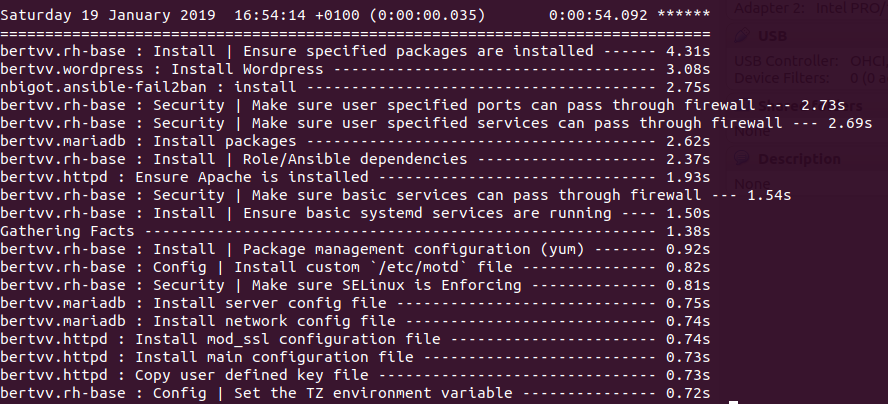
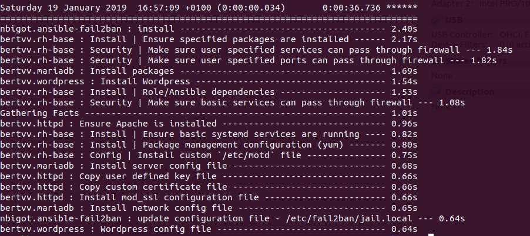
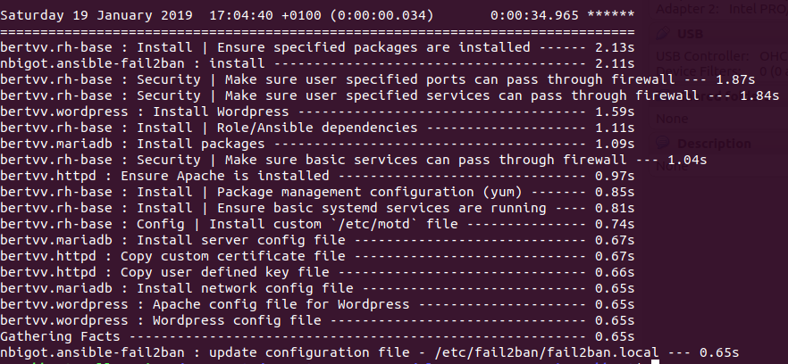

# Enterprise Linux Lab Report 02

- Student name: Maxim Eeckhout
- Github repo: <https://github.com/HoGentTIN/elnx-1819-sme-maximeeckhout>

Omschrijving:
* Fail2Ban
* Ansible sneller maken
* Ansible Vault

## Test plan

## Procedure/Documentation

### Fail2Ban

Deze rol voegen we toe aan pu004 zodat we deze beter kunnen beveiligen.

### Ansible versnellen

#### Profiling



Door in de ansible.cfg file een wijzig aan te brengen kunnen we timen hoe lang elke stap duurt. Deze tijd zullen we dus proberen te verkleinen

```
callback_whitelist = profile_tasks
```

#### SSH Pipelining
We wijzigen in ansible.cfg
```
[ssh_connection]
pipelining = True
```



#### ControlPersist
```
[ssh_connection]
pipelining = True
control_path = /tmp/ansible-ssh-%%h-%%p-%%r
```



### Ansible Vault

Ansible Vault wordt gebruikt om op een betere manier om te gaan met wachtwoorden, het zorgt ervoor dat de wachtwoorden niet op git komen.

In ```site.yml``` passen we die code van de fileserver aan zodat deze weet waar hij moet zoeken naar variabelen.
```
# FileServer
- hosts: pr011
  become: true
  vars_files:
    - vars/wachtwoorden.yml
  roles:
    - bertvv.rh-base
    - bertvv.samba
    - bertvv.vsftpd
```

Vervolgens maken we de file in de juiste map aan, deze map vullen we met de variablen en hun bijhoorende waarden:
```
---
# Variable: password
maxim: '$6$qLkmDMx8$lbOYYIrr13VirFuZp5aUYq7F9FkOthiYOiWOd.8hbDOIcuLmQjNaE2Pur2mEXU6ZQl0ny7HGGgXYogadFBVMA/'
stevenh: '$6$vcV0ycUBk5aIy6SH$87SrpX69iqODrI2jxJJ.WunSuznqGZVR/8G7YXp71WAtl/Y/zK1DDu3IR35pPAuJ1NiXMpWmclk4QdcRXZ261/'
stevenv: '$6$Z0N1M5s07a0H$Bb4K5VHiTKD.jxLXKknvilE2C0BfvkOWH6viZV5QClKvMHxapbuDbumkYF7zn8rFm68G/.QU9UEKZRMXLawsN.'
leend: '$6$mFnQ0PDTuqOfe9s$8AKOfr01PbkL2q6hv9lFmLOEgc.9or47hpHxlKDXCHgY85z1m0QAa0R7RdITSIjP38RIYg/ft9W23TuZAADHt.'
svena: '$6$zuxk1x1HRFGVcd$6UMds8ENl3YMjJ.BYRqGrEnvZ.umzzFsgoOGxeVfZqqsrs9ZTzDSuVvdIpbKHUH6ojW758klL0Yz45V6zPZGy/'
nehirb: '$6$fTGAz6fU/8F$VblmScoikLFn2dBWuM8DDunMW.vS4JOvM6VkzTXzK1XfqiFVEYL9/cISR0/yrha1R/RMw/6a.7NR2mLbcVsQW0'
alexanderd: '$6$uyN/EMoCLaVhOxBF$p6/89MsV4Usfkh8goXI/WOO86pFbCk3TeMfaFD30zWgmC2BtEvaRk/e2nlHB4uFXx0/ezqcEORSIj2deRgooq.'
krisv: '$6$A2vkx73E$N2dq0gNPh2IHbGSbgFT8FZQ3Csejfw58/chFuLz5fHMM7cOyNGm68KT/j3l/f8oL9ERLPDtj3HbL6P9OnY2tX/'
benoitp: '$6$2JV9xJNur$sRSGItc75qkBMQ0saeUT4g1LjnjqAWK/1hBrYYuxF0kkqIuq8LabxRwdjQO3P0Wad4UvNWU1rC0APKIo3X8dP0'
anc: '$6$PJQBHMMFqe$nKvp6Q8tRPi7maicPYhmmjoBWjFN/MWAVEnsqvLIlTxoqCu4Z9q/mBciD1IrUQ3otT7C4AxNIgO7kG7ROg4h0.'
elenaa: '$6$HDaG1NnNMiPofq1$fWSzBgBA3tBPYskNTF2mMrJNJem7QAlqWP/Ua3Peznw6G9EOW0IS/dijtdG5JNnbKUCyRxU3pIbcgP.pg97tK0'
evyt: '$6$HDaG1NnNMiPofq1$fWSzBgBA3tBPYskNTF2mMrJNJem7QAlqWP/Ua3Peznw6G9EOW0IS/dijtdG5JNnbKUCyRxU3pIbcgP.pg97tK0'
christophev: '$6$d/yBq64Bxh2UHRER$ZxZ3MQ24.EW4XeBVM4UjPpwc3JLBO9Gyp03xMWlwWYNa6FDaBMeM0wFGs9kY2PvOL8.os.0BztluXz/zUtdw1/'
stefaanv: '$6$yqx3uIAqrho$E.jxhyhDtjdPizRIPkwk0tx6ZfOkmmfmQnB9LwD9BN.4Z9WmVBcXCz4wxsN0i4pov3crKf3wkqjtjHbwUhhhv0'
```
Via ansible-vault kunnen we deze map beveiligen:
```
meeckhout@Dell-Maxim:~/Documents/HoGent 2018 - 2019/elnx-1819-sme-maximeeckhout/ansible/vars$ ansible-vault encrypt wachtwoorden.yml
New Vault password:
Confirm New Vault password:
Encryption successful
```
Om er voor te zorgen dat Vagrant het wachtwoord vraagt bij het runnen van ```vagrant up``` passen we de vagrant file aan:
```
# Provisioning configuration for Ansible (for Mac/Linux hosts).
  config.vm.provision ansible_mode do |ansible|
    ansible.playbook = host.key?('playbook') ?
        "ansible/#{host['playbook']}" :
        "ansible/site.yml"
    ansible.become = true
    ansible.compatibility_mode = '2.0'
    ansible.ask_vault_pass = true
```

## Test report

## Resources

* <https://docs.ansible.com/ansible/latest/installation_guide/intro_configuration.html>
* <https://github.com/jlafon/ansible-profile>
* <https://adamj.eu/tech/2015/05/18/making-ansible-a-bit-faster/>
* <https://github.com/nbigot/ansible-fail2ban>
* <https://acalustra.com/acelerate-your-ansible-playbooks-with-async-tasks.html>
